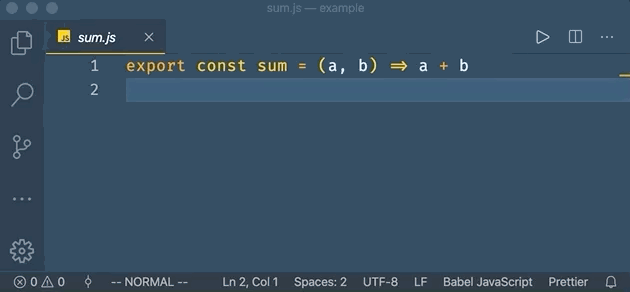

# Go To Test

This extension make it easier to navigate between source file and test file just like Intellij does.

## Features

* Open test file from source file
* Open source file from test file

## Usage
* Using `Go To Test` or using shortcut `cmd + shift + t`

| From                               | To                                 |
| ---------------------------------- | ---------------------------------- |
| `/user/demo/sum.js`                | `/user/demo/__tests__/sum.test.js` |
| `/user/demo/sum.js`                | `/user/demo/__tests__/sum.spec.js` |
| `/user/demo/__tests__/sum.test.js` | `/user/demo/sum.js`                |
| `/user/demo/__tests__/sum.test.js` | `/user/demo/sum.js`                |

> Not as you expected? [New Issue](https://github.com/futantan/go-to-test/issues/new) welcome!
